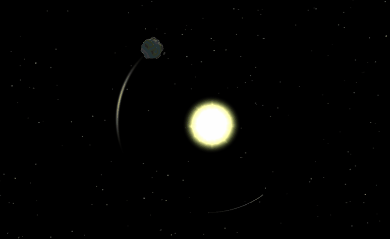

# Accretion - Endless Space Adventure

Accretion is an open-world, sandbox game set in an infinite abstract universe. Its an endless space adventure. 
Play as an asteroid, dwarf planet, planet, different types of stars, or black hole!  
Crash into space objets or "swallow" them. Make your own way to rule the universe. 
	
### This app is written in:
* C# 7.3
	
### It has a target deployment of:
* [iOS 11.0+](https://github.com/isp13/Accretion/releases/tag/v1)
* [Android 4.4+](https://play.google.com/store/apps/details?id=com.sinapsis.Space)
* [Windows 7 SP1+](https://github.com/isp13/Accretion/releases/tag/v1)
	
### It was created using:
* Unity 2019.3.1f
* Blender 2.82a

### Game Mechanics
#### Different space objects

<table>
  <tr>
    <td>Asteroid</td>
     <td>Dwarf planet</td>
     <td>Planet</td>
    <td>Dwarf star</td>
     <td>Star</td>
     <td>Giant Star</td>
     <td>Neutron star</td>
     <td>Black hole</td>
  </tr>
  <tr>
    <td></td>
    <td></td>
    <td></td>
    <td></td>
    <td></td>
    <td></td>
    <td></td>
    <td></td>
  </tr>
 </table>
 
 ### Orbits

	

### Gravity examples

<table>
  <tr>
    <td>too fast object</td>
     <td>on orbit</td>
     <td>crash into small one</td>
    <td>crash into equal</td>
  </tr>
  <tr>
    <td></td>
    <td></td>
    <td></td>
    <td></td>
  </tr>
 </table>
